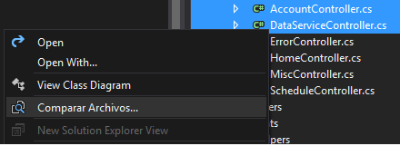

# File Differ

<!-- Replace this badge with your own-->

<!-- Update the VS Gallery link after you upload the VSIX-->
Download this extension from the [VS Gallery](https://visualstudiogallery.msdn.microsoft.com/[GuidFromGallery])
or get the [CI build](http://vsixgallery.com/extension/714967d5-ee17-4bb1-a719-8cbf33d3bca9/).

---------------------------------------

The easiest way to diff two files directlty from Solution Explorer

See the [change log](CHANGELOG.md) for changes and road map.

## Features

- Compare two files in solution explorer

### Compare Files
Select two file sin solution explorer and
right-click.

The select *Comparar Archivos..* to see 
the diff view

## Contribute
Check out the [contribution guidelines](CONTRIBUTING.md)
if you want to contribute to this project.

For cloning and building this project yourself, make sure
to install the
[Extensibility Tools 2015](https://visualstudiogallery.msdn.microsoft.com/ab39a092-1343-46e2-b0f1-6a3f91155aa6)
extension for Visual Studio which enables some features
used by this project.

## License
[Apache 2.0](LICENSE)